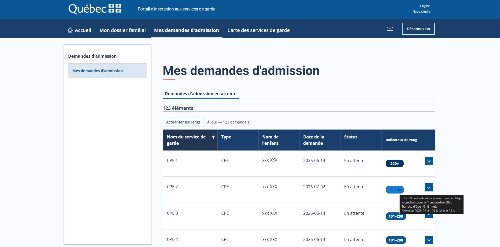

# Rang garderies QC

> [!NOTE]
> La première version de cette extension a été **vibe codée avec Claude Code**.
>
> J’ai revu l’implémentation et elle répond à mes besoins pour mon usage personnel. Je la partage publiquement afin qu’elle puisse éventuellement aider d’autres parents à naviguer plus facilement sur le site des demandes d’admission à un service de garde.
>
> Cette extension est fournie **telle quelle**, sans garantie quant à son exactitude, sa fiabilité, sa sécurité ou sa compatibilité avec les évolutions futures du site web. Elle n’est pas affiliée, approuvée ou maintenue par l’organisme responsable du service concerné.
>
> **Utilisez-la à vos propres risques.** Il vous appartient de vérifier les informations affichées et de vous assurer que son utilisation convient à votre situation. L’auteur ne saurait être tenu responsable des erreurs, pertes de données, demandes manquées ou autres conséquences découlant directement ou indirectement de son utilisation.


Extension Chrome locale (non publiée) qui ajoute une colonne **« Indicateur de rang »**
au tableau *Mes demandes d'admission* du
[Portail d'inscription aux services de garde du Québec](https://www.portail-servicesgarde.gouv.qc.ca/).

Sans elle, connaître le rang d'un enfant demande, pour **chaque** garderie :
ouvrir le menu de la ligne → *Consulter la demande d'admission* → *Voir l'indicateur de rang*.
L'extension fait ce parcours en arrière-plan pour toutes les lignes à la fois.



## Installation

1. Ouvre `chrome://extensions`.
2. Active **Mode développeur** (interrupteur en haut à droite).
3. Clique **Charger l'extension non empaquetée** et choisis ce dossier
   (`rang-service-de-garde-QC`, celui qui contient `manifest.json`).
4. Ouvre — ou recharge — la page *Mes demandes d'admission* du portail.

Aucune connexion n'est gérée par l'extension : elle réutilise la session déjà
ouverte dans ton navigateur.

## Utilisation

La colonne apparaît juste avant la colonne des menus, et les rangs se relèvent
automatiquement à l'ouverture de la page (~1 s par garderie, 3 en parallèle).

- **Pastille colorée** : la tranche affichée par la jauge du portail
  (`0–10`, `11–50`, `51–100`, `101–200`, `200+`), aux couleurs des arcs de cette
  jauge — plus la pastille est foncée, plus il y a d'enfants devant.
- **Survol** : la phrase exacte du portail, la date de projection et la tranche
  d'âge de l'enfant à cette date.
- **Clic** : ouvre la page officielle de l'indicateur dans un nouvel onglet.
- **Clic sur l'en-tête « Indicateur de rang »** : trie le tableau par rang
  (meilleurs rangs d'abord → l'inverse → retour à l'ordre du portail). Les lignes
  sans rang lisible (`n/d`, `⚠`, `?`, pas encore relevées) restent en bas dans les
  deux sens. Le tri ne porte que sur la page affichée, comme celui du portail.
- **Bouton « Actualiser les rangs »** (au-dessus du tableau) : relit tout,
  en ignorant le cache.
- **Icône de l'extension** : réglages (relevé automatique, durée de validité du
  cache, nombre de pages chargées en parallèle) et vidage du cache.

Les valeurs sont mises en cache localement pendant 12 h par défaut, donc les
visites suivantes s'affichent instantanément.

`n/d` = le portail n'affiche pas d'indicateur pour cette demande.
`⚠` = échec de lecture ; le détail est dans l'infobulle.

## Comment ça marche

| Étape | Mécanisme |
| --- | --- |
| Voir le tableau | Le portail est une application LWC qui **remplace `attachShadow` et le getter `shadowRoot`**. Depuis le monde isolé d'une extension, `host.shadowRoot` vaut `null` : le tableau est invisible et rien ne peut y être injecté. Toute la logique tourne donc dans `src/page.js`, déclaré `"world": "MAIN"`. |
| Récupérer l'identifiant de chaque demande | Le tableau est le composant `<c-gu-tableau-donnees-sub-cmp>` ; ses lignes vivent dans sa propriété `listeDonnees`, qui contient le champ `identifiant` — exactement l'`?id=` de la page de rang. Aucun clic, aucune navigation intermédiaire. |
| Lire le rang | `/parent/s/indicateur-de-rang?id=<identifiant>&modeList=true` est chargée dans une iframe cachée hors écran. La page étant de même origine, son texte est lisible directement. |
| Extraire la valeur | La jauge affiche cinq étiquettes ; seule la bonne est suivie de « de la même tranche d'âge ». C'est cette accroche qu'utilise `src/rank.js` (variante anglaise incluse). |
| Trier par le rang | Le tri natif du portail réordonne `listeDonnees` puis re-rend : il ignore une colonne ajoutée après coup. `src/page.js` déplace donc lui-même les `<tr>` et réapplique l'ordre à chaque rendu ; l'ordre du portail est mémorisé, il sert à départager les ex æquo et à revenir en arrière. |
| Stocker | Le contexte de la page n'a pas accès aux API `chrome.*` : `src/content.js`, lui, y a accès et sert de passe-plat pour le cache, les réglages et les commandes de la popup. Les charges utiles transitent **en JSON**, car les objets réactifs de LWC ne survivent pas au clonage structuré de `postMessage`. |

Une iframe est réutilisée d'une garderie à l'autre par « ouvrier », et la
concurrence est volontairement basse (3) pour ne pas marteler le serveur.

## Fichiers

```
manifest.json          permissions (storage) + déclaration des scripts
src/dom.js       MAIN  traversée du shadow DOM, texte de l'arbre composé, attente active
src/rank.js      MAIN  analyse de la page « Indicateur de rang »
src/page.js      MAIN  orchestration, iframes, colonne, tri et barre d'outils
src/content.js  isolé  stockage (chrome.storage) et relais des commandes de la popup
popup/                 réglages et actions manuelles
```

## Portée et limites

- **Permissions** : `storage` seulement, plus l'accès aux deux hôtes du portail
  (`portail-servicesgarde.gouv.qc.ca` et `www.…`). Aucune requête vers un tiers,
  aucune donnée qui sort du navigateur.
- L'extension **lit** ; elle ne soumet, ne modifie et n'annule aucune demande.
- Elle dépend de détails internes du portail (nom du composant LWC, format de la
  phrase de la jauge). Une refonte du site peut la casser : dans ce cas le badge
  affiche `⚠` ou `?` et l'infobulle indique ce qui a été vu.
- Testée sur la liste « Demandes d'admission en attente » avec 13 demandes pour
  un enfant ; l'appariement ligne ↔ demande se fait sur (service de garde, enfant),
  donc plusieurs enfants dans la même liste sont gérés.
